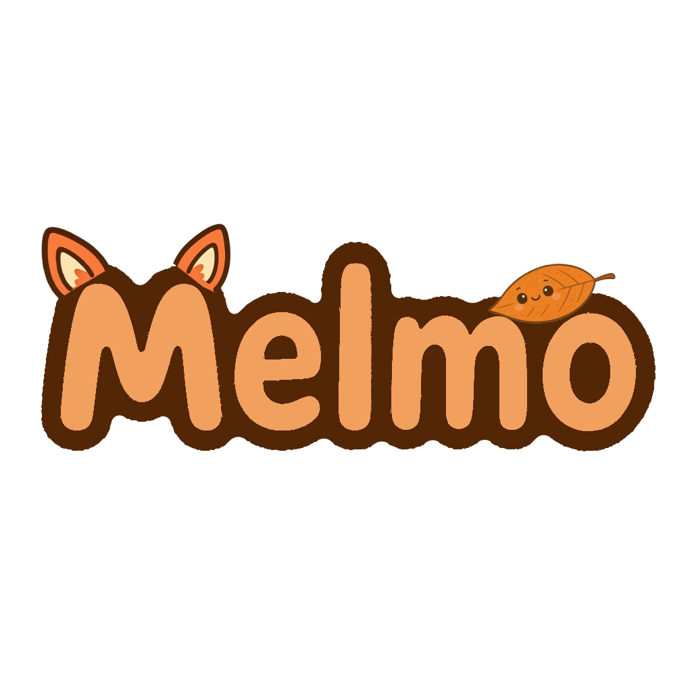

<div align="center">

# 🍃 Melmo - Générateur de Mots Mêlés Magique



### ✨ Créez des grilles de mots mêlés personnalisées en quelques clics !

[](https://reactjs.org/)
[](https://www.typescriptlang.org/)
[](https://vitejs.dev/)
[](https://developer.mozilla.org/en-US/docs/Web/HTML)
[](https://developer.mozilla.org/en-US/docs/Web/CSS)

[](https://netlify.com/)
[](https://vercel.com/)

</div>

---

## 🎯 À propos

**Melmo** est un générateur de mots mêlés moderne et intuitif, conçu pour créer des grilles personnalisées avec une interface utilisateur enfantine. Parfait pour les enseignants, les parents, ou toute personne souhaitant créer des jeux de mots mêlés de qualité professionnelle.

### 🌟 Fonctionnalités principales

- 🎮 **Interface intuitive** - Création en 3 étapes simples
- 🎨 **Design enfantin** - Interface colorée et amusante
- 📏 **Grilles adaptatives** - Tailles de 10x10 à 25x25
- 🎯 **3 niveaux de difficulté** - Facile, Moyen, Difficile
- 📚 **Dictionnaire français** - API Trouve-mot.fr intégrée
- 🖨️ **Export PDF/Impression** - Pour imprimer les grilles
- ⚙️ **Options avancées** - Personnalisation complète
- 📱 **Responsive** - Compatible mobile et desktop

---

## 🚀 Démarrage rapide

### Prérequis

- [Node.js](https://nodejs.org/) (version 18 ou supérieure)
- [npm](https://www.npmjs.com/) ou [yarn](https://yarnpkg.com/)

### Installation

```bash
# Cloner le repository
git clone https://github.com/Ronnardd/melmo.git

# Aller dans le dossier
cd melmo

# Installer les dépendances
npm install

# Lancer le serveur de développement
npm run dev
```

L'application sera accessible sur `http://localhost:3000`

---

## 🛠️ Technologies utilisées

### Frontend
- **React 19.1.1** - Bibliothèque UI moderne
- **TypeScript 5.8.3** - Typage statique
- **Vite 7.1.6** - Build tool ultra-rapide
- **CSS3** - Styles modernes et responsive
- **Lucide React** - Icônes vectorielles

### Bibliothèques
- **jsPDF** - Génération de PDF
- **html2canvas** - Capture d'écran pour export
- **Trouve-mot.fr API** - Dictionnaire français

### Déploiement
- **Netlify** - Hébergement statique
- **Vercel** - Alternative de déploiement

---

## 📖 Guide d'utilisation

### 1. 🎯 Choisir la difficulté
- **Facile** : Grille 10x10, mots courts
- **Moyen** : Grille 15x15, mots variés  
- **Difficile** : Grille 20x20, mots complexes

### 2. ⚡ Générer la grille
- Cliquez sur "Générer une nouvelle grille"
- Attendez la génération automatique
- Visualisez le résultat instantanément

### 3. 📤 Exporter
- **PDF** : Export haute qualité
- **Impression** : Format optimisé
- **Options** : Personnalisation avancée

---

## ⚙️ Configuration avancée

### Paramètres personnalisables
- **Taille de grille** : 10x10 à 25x25
- **Police** : Arial, Comfortaa, DynaPuff
- **Taille de police** : 12px à 24px
- **Directions** : Horizontal, Vertical, Diagonal
- **Mots inversés** : Activé/Désactivé

### Mots personnalisés
- Ajout de mots spécifiques
- Import/Export de listes
- Gestion des catégories

---

## 🎨 Personnalisation

### Thème Enfantin
- Couleurs pastel et douces
- Animations fluides
- Icônes expressives
- Design responsive

### Styles CSS
```css
/* Variables de couleurs principales */
:root {
  --primary-color: #FF8C42;
  --secondary-color: #FFB6C1;
  --accent-color: #8B4513;
  --background: linear-gradient(135deg, #FFE4B5 0%, #FFB6C1 50%, #FFA07A 100%);
}
```

---

## 📁 Structure du projet

```
melmo/
├── public/
│   ├── melmofeuille.png    # Logo principal
│   └── examples.json       # Exemples de grilles
├── src/
│   ├── components/         # Composants React
│   │   ├── ExportPanel.tsx
│   │   ├── WordGridGenerator.tsx
│   │   ├── SolutionViewer.tsx
│   │   └── ...
│   ├── services/           # Services API
│   │   └── dictionaryService.ts
│   ├── types.ts           # Définitions TypeScript
│   └── App.tsx            # Composant principal
├── package.json
├── vite.config.ts
└── README.md
```

---

## 🚀 Scripts disponibles

```bash
# Développement
npm run dev          # Serveur de développement

# Build
npm run build        # Build de production
npm run preview      # Aperçu du build

# Analyse
npm run build:analyze # Analyse du bundle

# Déploiement
npm run deploy:netlify  # Déploiement Netlify
npm run deploy:vercel   # Déploiement Vercel
```

---

## 🤝 Contribution

Les contributions sont les bienvenues ! Pour contribuer :

1. **Fork** le projet
2. Créez une **branche** pour votre fonctionnalité (`git checkout -b feature/AmazingFeature`)
3. **Commit** vos changements (`git commit -m 'Add some AmazingFeature'`)
4. **Push** vers la branche (`git push origin feature/AmazingFeature`)
5. Ouvrez une **Pull Request**

---

## 📝 Changelog

### Version 1.0.0
- ✨ Interface enfantine
- 🎮 Générateur de grilles intelligent
- 📚 Intégration API Trouve-mot.fr
- 🖨️ Export PDF et impression
- 📱 Design responsive
- ⚙️ Options de personnalisation avancées

---

## 📄 Licence

Ce projet est sous licence MIT. Voir le fichier [LICENSE](LICENSE) pour plus de détails.

## 🙏 Remerciements

- [Trouve-mot.fr](https://trouve-mot.fr/) pour l'API de dictionnaire français
- [Lucide](https://lucide.dev/) pour les icônes
- [Google Fonts](https://fonts.google.com/) pour les polices
- Communauté React et TypeScript

---

<div align="center">

### ⭐ N'hésitez pas à donner une étoile si ce projet vous plaît !

[](https://github.com/Ronnardd/melmo)
[](https://github.com/Ronnardd/melmo)

**Fait avec ❤️ et beaucoup de ☕**

</div>